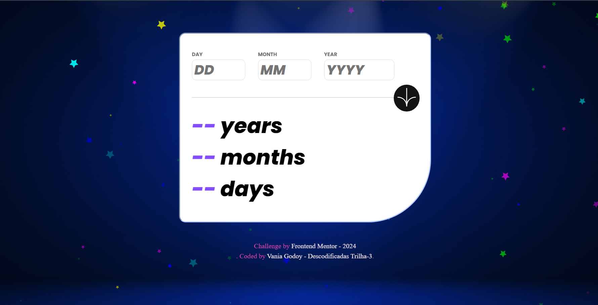
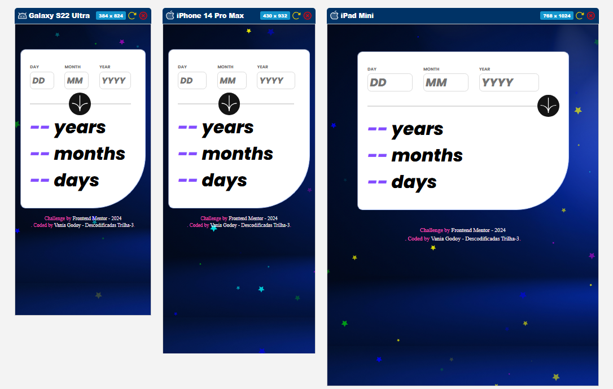
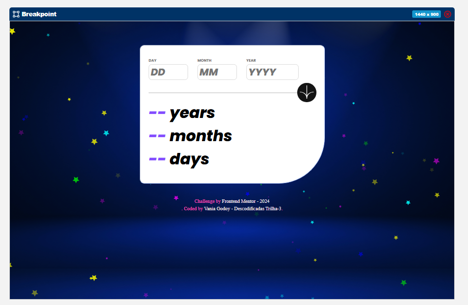

# Age Calculator App

Este é um projeto desenvolvido como parte de um desafio da [Frontend Mentor](https://www.frontendmentor.io). O aplicativo calcula a idade em anos, meses e dias a partir de uma data inserida pelo usuário.

 

---

## 📋 Sobre o Projeto

O **Age Calculator App** permite que os usuários insiram uma data específica (dia, mês e ano) e obtenham sua idade exata em anos, meses e dias. 

O design é responsivo, garantindo que funcione bem em dispositivos móveis e desktops.

---

## 🚀 Tecnologias Utilizadas

- **HTML5**: Estrutura do projeto.
- **CSS3**: Estilização e responsividade.
- **JavaScript**: Validação e cálculo da idade.
- **[tsparticles](https://cdn.jsdelivr.net/npm/tsparticles@2.10.0/tsparticles.bundle.min.js)**: Efeitos visuais interativos de partículas no fundo, que se afastam ao passar do cursor.

---

## 🖥️ Visualização do Projeto

Você pode visualizar o projeto acessando o seguinte link: https://vaniagodoy.github.io/age-calculator-app/ .

Você pode visualizar o repositório acessando o seguinte link: https://github.com/VaniaGodoy/age-calculator-app .

---

## 🛠️ Funcionalidades

- Validação dos campos de entrada (dia, mês, ano).
- Cálculo da idade exata com base na data de nascimento.
- Interface intuitiva e minimalista.
- Fundo dinâmico com partículas interativas.

---

## 📸 Preview do Projeto
Mobile

 

Desktop

 

---

## 🧑‍💻 Autor
Desenvolvido por: Vania Godoy - Descodificadas Trilha-3

Desafio: Frontend Mentor - Age Calculator App

---

## 🌟 Agradecimentos
A equipe da Frontend Mentor por criar desafios incríveis.

A comunidade Descodificadas Trilha-3 pelo suporte e aprendizado compartilhado.